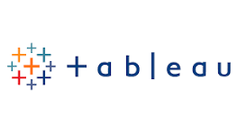

# Hi everyone!

 
I'm Rishab Tirupathi, a current graduate student studying Statistics at the University of Illinois at Urbana-Champaign. I am looking for internships where I can solve tough quantitative problems in any industry from Finance, Tech, Agriculture and beyond! 

### Education
- **MS in Statistics** @ [_University of Illinois at Urbana-Champaign_](https://illinois.edu/)
  - Expected December 2025
- **BS in Applied Mathematics and Statistics** @ _University of Illinois at Urbana-Champaign_
  - Graduated with a double major in December 2023 with a GPA of 3.81/4.00
  - Highest Distinction for both majors
  - Coursework for [Mathematics](https://rishab-t0910.github.io/website/courses/math) and [Statistics](https://rishab-t0910.github.io/website/courses/stats)
 
### Experiences
- **Machine Learning Intern** @ _FrostDefense Envirotech_, January to May 2024
- **Analytics Intern** @ _Chicago Blackhawks_, June to August 2023
- **Platoon Commander** @ _Singapore Armed Forces_, June 2018 to July 2020

### Skills
_Programming Languages_: Git, **Python**, **R**, SQL

_Software_: DBT, Microsoft Excel, Snowflake, Tableau (BI)

_Python Libraries_: Matplotlib, NumPy, pandas, scikit-learn, SciPy, seaborn, statsmodels, TensorFlow!

_R Libraries_: dplyr, ggplot2, tidyverse, tsa

#### Programming Languages

    

        
        
DBT

    

    

        
        
Excel

    

    

        
        
Snowflake

    

    

        
        
Tableau

    

#### Software

    

        
        
Git

    

    

        
        
Python

    

    

        
        
R

    

    

        
        
SQL

    

